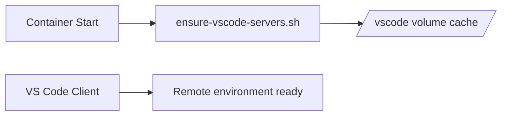
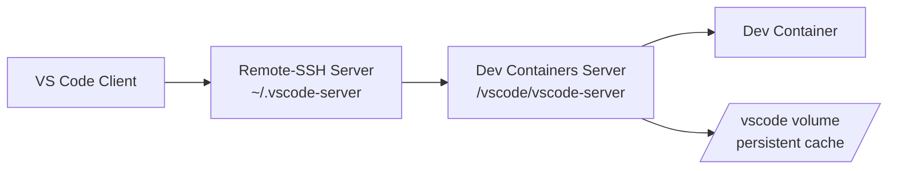

# SSH Bridge

SSH Bridge project provides a bridge over SSH using Docker containers. It includes two components: the SSH client and the SSH server.


## Prerequisites

- Docker
- Docker Compose
- Make Utility

## Usage

We use `make` commands for various operations in this project. Below is a brief description of each command.

1. **Building the Docker image:**

```bash
make build
```
This command is used to build the Docker image.

2. **Pushing the Docker image:**

```bash
make push
```
This command pushes the built Docker image to the specified repository.

3. **Pulling the Docker image:**

```bash
make pull
```
This command pulls the image from the specified repository.

4. **Generating SSH Keys:**

```bash
make generate-ssh-keys
```
This command generates new SSH keys.

5. **Launching the SSH Server:**

```bash
make server-up
```
This command starts the SSH server.

6. **Launching the SSH Client with a local docker container:**

```bash
make proxy
```
This command starts the SSH tunnel from a local docker container.
It can be used if SSH is not installed locally.

7. **Launching the SSH Client from your machine directly**

Add this to your *.bashrc*. You have to adjust some values like `workspace/docker-ssh-bridge/id_rsa` to where you did clone the current project

```bash
# Distant docker socket over ssh
export SSH_DOCKER_SERVER_HOST=bbrodriguez.example.org
export SSH_DOCKER_SERVER_PORT=21312
export SSH_DOCKER_SERVER_USER=devuser

# Expose distand dockerd socket locally with DOCKER_HOST
client_ssh_docker_tunnel_host=localhost
client_ssh_docker_tunnel_port=23750
# ssh docker tunnel creation if not exist
nc -z ${client_ssh_docker_tunnel_host} ${client_ssh_docker_tunnel_port}
if [ $? -ne 0 ] ; then
    # if private key exists use it directly
    if [ -f workspace/docker-ssh-bridge/id_rsa ] ; then
        ssh -i workspace/docker-ssh-bridge/id_rsa -NL ${client_ssh_docker_tunnel_host}:${client_ssh_docker_tunnel_port}:/var/run/docker.sock ${SSH_DOCKER_SERVER_USER}@${SSH_DOCKER_SERVER_HOST} -p ${SSH_DOCKER_SERVER_PORT} &
    fi
fi

export DOCKER_HOST=tcp://${client_ssh_docker_tunnel_host}:${client_ssh_docker_tunnel_port}
```

8. **Cleaning up:**

```bash
make clean
```
This command deletes the generated SSH keys.


Use these commands as per your requirements.

## VS Code Remote Server Behavior

This project is commonly used together with **VS Code Remote‑SSH** and **Dev Containers**.  
By default, VS Code uploads its server components from the client machine when a remote
connection is established. This can consume a significant amount of bandwidth (for example
when working over a mobile or slow connection).

**Note about VS Code settings**

VS Code provides a setting that can partially control this behavior:

```
"remote.SSH.localServerDownload": "off"
```

This instructs VS Code to download the server directly from the remote host instead of
uploading it from the client. However, this setting only applies to **Remote‑SSH**.

When using **Dev Containers** (which internally uses the `remote‑containers` extension),
this option is ignored and VS Code may still attempt to upload server components.

The approach used in this project avoids relying on client‑side VS Code configuration.
By installing the server inside the container beforehand, both **Remote‑SSH** and
**Dev Containers** connections work consistently without requiring any special settings
on the developer machine.

This design intentionally avoids relying on client‑side VS Code settings.  
If the VS Code behavior becomes consistent in the future (for example if the
`remote.SSH.localServerDownload` setting is honored by **Dev Containers** as well),
this additional pre‑installation layer may become unnecessary and could be removed.

A tracking issue was opened upstream to document this limitation:
https://github.com/microsoft/vscode-remote-release/issues/11460

To avoid this behavior, the container can **pre‑install the VS Code server** before the first
connection.

### Default VS Code behavior vs this project

Normally, when VS Code connects through **Remote‑SSH**, it performs the following steps:


This means the VS Code client uploads ~100–200 MB of server binaries and extensions over SSH.
On slow networks (for example mobile connections), this can noticeably delay the first connection.

With **SSH Bridge**, the server components are installed **before the connection happens**:



As a result, when VS Code connects it finds the server already installed and **skips the upload step**.

The container entrypoint automatically runs:

```
ensure-vscode-servers.sh
```

This script ensures that both components are installed if missing:

- the **Remote‑SSH server**
- the **Dev Containers server**


The installation is **idempotent**, meaning it runs safely on every container start and
installs components only when necessary.

### Connection flow overview

The following diagram summarizes how VS Code connects when using **Remote‑SSH** and **Dev Containers** with this bridge:



In this setup:

- The **Remote‑SSH server** runs on the host and handles the initial connection.
- The **Dev Containers server** runs inside the container environment.
- The `/vscode` volume stores the server binaries and extension cache so that
  VS Code does not need to upload them from the client on each connection.

### Selecting the VS Code server commit

The commit used to install the server can be controlled via environment variables:

```
VSCODE_SERVER_COMMIT
VSCODE_SERVER_ARCH
```

They are defined in `docker-compose.yml` with sensible defaults:

```
VSCODE_SERVER_COMMIT=${VSCODE_SERVER_COMMIT:-0870c2a0c7c0564e7631bfed2675573a94ba4455}
VSCODE_SERVER_ARCH=${VSCODE_SERVER_ARCH:-linux-x64}
```

You can override them when starting the server:

```
VSCODE_SERVER_COMMIT=<commit> make server
```

### Updating the server without rebuilding the image

The project also provides a helper target:

```
make ensure-vscode-server-commit
```

This command installs the corresponding server in the running container.

This allows updating the VS Code server **without rebuilding the Docker image or
recreating the container**.

This design keeps the image simple while avoiding unnecessary uploads from the VS Code
client.

**Note:**
The `REPOSITORY` variable can be set to your Docker Hub username or any other registry where you wish to push your images. If not specified, it defaults to `dbndev`.

```bash
make push REPOSITORY=your_dockerhub_username
```

Please ensure that you have proper permissions set for your SSH files/directory.

Enjoy using SSH Bridge!